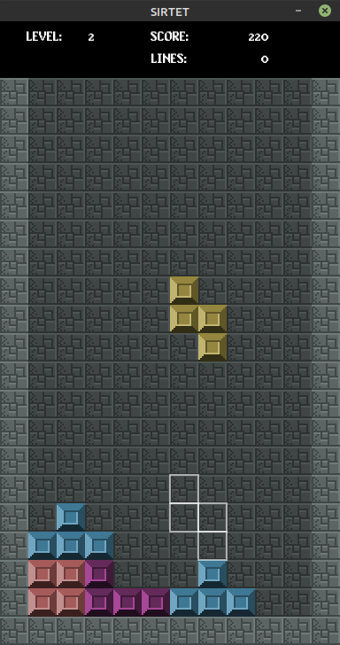

# SIRTET
## tetrominos in lua

Made with the excellent Love2D game framework/engine. Wrote this back when I finally made up my mind to pursue software engineering in earnest (2013?) and my mind went "Oh yeah? Well prove it."

### running
* have Love2d on your system (`apt install love`, for example)
* `git clone https://github.com/drproteus/sirtet.git`
* `love sirtet`

### controls
* any key starts from the title.
* `left` and `right` to move your piece side to side.
* `up` rotates clockwise.
* `down` accelerates downward motion
* `space` hard drops the piece where it would fall vertically.
* `p` pauses the game
* when paused, `q` exits the application
* `g` toggles ghosting (initially off)
* `1-0` sets the "level" to this number-- just modifies speed where the higher the level, the faster the piece (save 0, which is MAX LEVEL).

**NOTE**: there is no counter-clockwise motion... yet!




---

Apparently, one of the first tilesets I made to test with was just my LastFM top-albums at the time heavily scaled down. To run with this tileset,
```
love sirtet images/96.png
```

